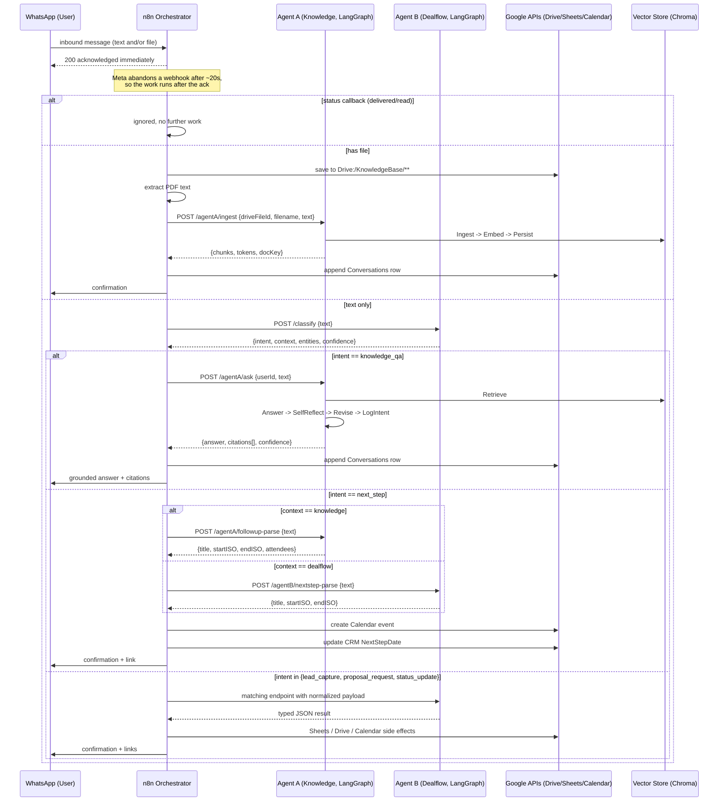
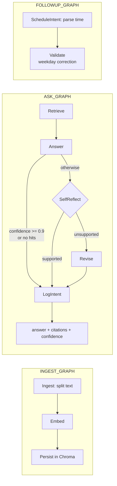
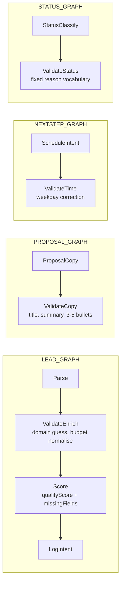
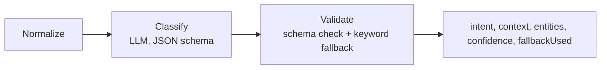

# Architecture

The `.mmd` files beside this one hold the same diagrams as standalone Mermaid
sources (`sequence-diagram.mmd`, `agentA-graph.mmd`, `agentB-graph.mmd`). They
are embedded here too, because GitHub renders Mermaid inside Markdown but not
`.mmd` files on their own.

## End-to-end sequence

## Agent A — Knowledge

The self-reflection pass is conditional: it is skipped when nothing was
retrieved, or when the first answer already scored 0.9 or above. The common
case therefore costs one LLM call, not two.

## Agent B — Dealflow

## Shared intent classifier

One mini-graph rather than duplicated logic in both agents. When the model
returns something off-schema, an ordered keyword fallback still produces a
route, and `fallbackUsed` records which path ran.

## Deviations from the suggested layout

`§10` of the brief suggests `docker-compose.yml` and `env.sample` under
`/infra/`, and per-agent `tests/` directories. This repository keeps
`docker-compose.yml` and `env.sample` at the root, and a single top-level
`tests/`.

- **Compose at the root** so `docker compose up -d --build` works with no `-f`
  flag, which is what the brief's own one-command bootstrap asks for. Moving it
  under `/infra/` would require every build context and volume path to reach
  back out with `../`.
- **One `tests/` directory** because the suite loads both agents in the same
  process to prove they stay independent — they each define a `graph.py` and a
  `tools.py`, and `tests/conftest.py` loads them by path so the names cannot
  collide. Splitting the suite per agent would lose that check.
